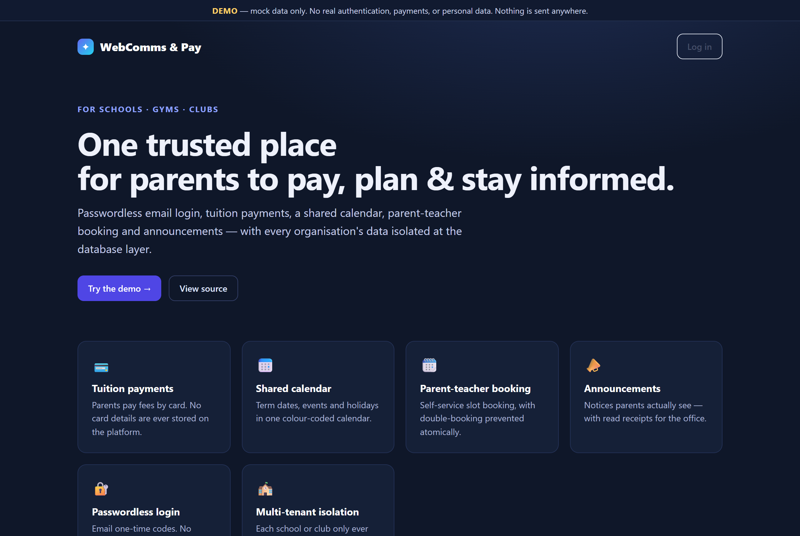
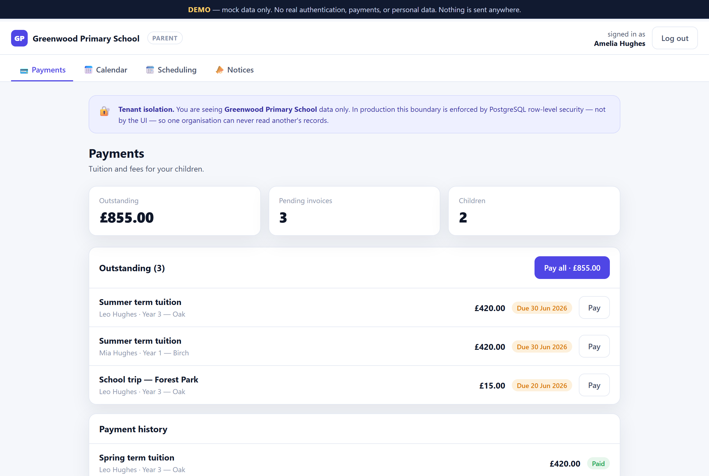
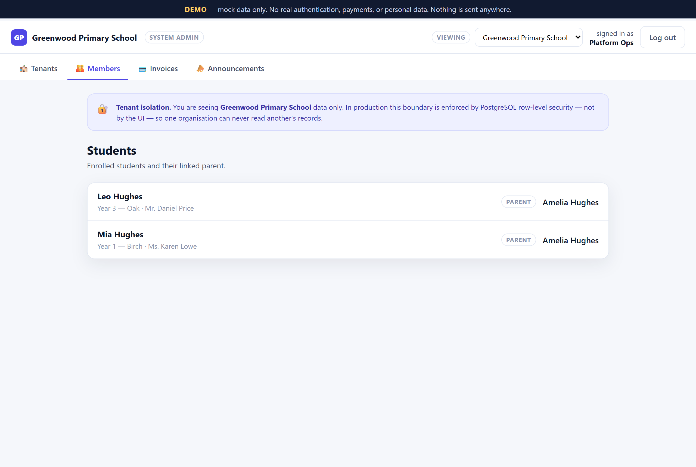

<div align="center">

# 🏫 WebComms & Pay

### A passwordless, multi-tenant payments & communication platform for schools, gyms, and clubs.

Parents log in with a one-time email code — no passwords — to pay tuition, view the
calendar, book parent-teacher meetings, and read announcements. Every organisation sees
**only its own data**, enforced at the database layer, not in application code.

<br>

[**▶ Live Demo**](https://htetaungkyaw-gicjp.github.io/webcomms-pay/) &nbsp;·&nbsp;
[**📋 Implementation Plan**](.claude/plan/PLAN.md) &nbsp;·&nbsp;
[**🤖 Built with Claude Code**](#-engineered-with-claude-code)

<br>


<br>

<a href="https://htetaungkyaw-gicjp.github.io/webcomms-pay/">
  
</a>

</div>

---

## Why this repo is interesting

This isn't a tutorial CRUD app. It's a **security-first design study** of the hardest part
of multi-tenant SaaS: keeping one school's children, payments, and messages provably
invisible to every other tenant — in a **public repository** that will hold Stripe keys
and minors' personal data.

The work on display is the **engineering process**, not just a product:

- 🧠 **Plan before code.** A complete, phased [implementation plan](.claude/plan/PLAN.md)
  resolves the irreversible decisions up front — tenant-isolation model, GDPR
  erasure-vs-retention split, the auth/onboarding spine — *before* a single line of app
  code is written. These can't be retrofitted, so they're decided first.
- 🔒 **Defense in depth, by design.** Row-Level Security is the real boundary; app checks
  are backups. The service-role key is treated as radioactive. Secrets never touch a
  commit — and that's enforced by tooling, not good intentions.
- 🤖 **Custom AI tooling as guardrails.** A reusable RLS-policy auditor, a secret-leak
  gate, and read-only MCP database access turn the security rules into checks that *run*.

> ⚠️ **Public repo · payment keys · minors' PII.** Every credential is a `${VAR}`
> placeholder or empty. A secret that ever reaches a commit is considered compromised and
> **must be rotated**. See [CLAUDE.md](CLAUDE.md) for the full rules.

---

## ▶ Try the live demo

A fully interactive, **mock-data** demo — no backend, no real auth, no real money, nothing
leaves your browser. Reloading resets everything.

🔗 **https://htetaungkyaw-gicjp.github.io/webcomms-pay/** &nbsp;(one-time code: **`123456`**)

<table>
  <tr>
    <td width="50%" valign="top">
      <br>
      <b>Parent portal</b> — tabbed payments, calendar, scheduling & notices, with live
      invoice totals and status badges.
    </td>
    <td width="50%" valign="top">
      <br>
      <b>System admin</b> — the only role that crosses tenants. Note the
      <i>“tenant isolation”</i> banner: in production that boundary is a Postgres policy.
    </td>
  </tr>
</table>

| Log in as… | …and you'll see |
|---|---|
| 👩 **Amelia (parent, Greenwood)** | Her two children's invoices, the school calendar, scheduling, and notices |
| 👨 **Omar (parent, Riverside)** | A *completely separate* tenant's data — proof of isolation |
| 🧑‍💼 **Sarah (admin, Greenwood)** | Manage students, invoices, and announcements for one org |
| 🛡️ **Platform Ops (system admin)** | Switch between tenants — the *only* role that crosses the boundary |

The headline moment: log in as a parent, then try to reach the other organisation. You
can't — and in production, that "can't" is a Postgres policy, not a missing button.

Run it locally:
```bash
cd demo && python -m http.server 8000   # → http://localhost:8000
```

---

## 🏗️ Architecture at a glance

```
            ┌──────────────────────────────────────────────────────────┐
  Invite ──▶│  email + one-time code (OTP)                              │
  token     │            │                                             │
            │            ▼                                             │
            │   003 trigger binds user → tenant_id + role  (fail-closed)│
            │            │                                             │
            │            ▼                                             │
            │   middleware guard  →  /[tenant-slug]  resolution         │
            │            │                                             │
            │            ▼                                             │
            │   ╔═══════════════════════════════════════════════════╗  │
            │   ║   ROW-LEVEL SECURITY  ·  the real boundary          ║  │
            │   ║   every row scoped to current_tenant_id()           ║  │
            │   ╚═══════════════════════════════════════════════════╝  │
            │            │                                             │
            │            ▼                                             │
            │   Stripe Checkout (server-authoritative amounts)         │
            │            │                                             │
            │            ▼                                             │
            │   idempotent webhook  →  invoice = paid                  │
            └──────────────────────────────────────────────────────────┘
```

The **onboarding spine** is the make-or-break path, so the plan proves it end-to-end on a
thin slice ("Phase 0") before building any features — because if auth→tenant binding is
wrong, every feature on top of it is wrong too.

**Security invariants that span the whole system:**

- **Tenant isolation lives in the database.** RLS policies — not the UI, not the API — are
  the source of truth. The `[slug]` membership check is defense-in-depth.
- **The invite token is the authorization proof.** Possessing the invited inbox (OTP)
  *and* an unguessable token are both required; no match → no profile → no access.
- **`system_admin` short-circuits first** in every policy (they have `tenant_id = NULL`, so
  without it they'd be locked out of everything).
- **RLS helpers live in a `private` schema**, `SECURITY DEFINER` with `search_path = ''` —
  a missing `search_path` is a privilege-escalation hole.
- **The service-role client bypasses RLS**, so every route that uses it re-authenticates
  *and* re-authorizes the specific resource in code (the IDOR/tampering defense).
- **`tenant_id` always comes from the authenticated session, never the request body.**
- **GDPR by schema:** PII is erasable; financial records are *pseudonymised and retained*
  for the statutory window — never blindly cascade-deleted.

→ Full detail, per-table policies, and migrations `001–004` in
[the implementation plan](.claude/plan/PLAN.md).

---

## 🤖 Engineered with Claude Code

This repo was built plan-first with [Claude Code](https://claude.com/claude-code), with
the security rules encoded as **tooling that runs**, not prose that's hoped-for:

| Tool | What it does |
|---|---|
| 🔌 **MCP servers** ([.mcp.json](.mcp.json)) | Read-only Supabase access for safe schema/RLS introspection + GitHub for PRs — credentials injected via `${VAR}`, never literals |
| 🧪 **RLS-policy-check skill** ([SKILL.md](.claude/skills/rls-policy-check/SKILL.md)) | Audits any migration against the tenant-isolation invariants and reports a pass/fail list with `file:line` for each violation |
| 🕵️ **Secret-leak-auditor agent** ([agent](.claude/agents/secret-leak-auditor.md)) | A read-only gate that scans the working tree *and git history* for committed keys before any push or going public |

The git history reads as a clean build log: plan → config → skill → agent → demo, with the
secret-leak gate run before publishing.

---

## 🛠️ Planned stack

| Concern | Choice |
|---|---|
| Frontend / Backend | **Next.js 16** (App Router, TypeScript) |
| Database & Auth | **Supabase** (PostgreSQL · Email OTP · Row-Level Security) |
| Payments | **Stripe** (server-authoritative Checkout + idempotent webhooks) |
| Email | **Resend** |
| Rate limiting | **Upstash Redis** |
| UI | **shadcn/ui** + **Tailwind CSS** |
| Hosting | **Vercel** |

---

## 📍 Status & roadmap

| | |
|---|---|
| ✅ Interactive demo (mock data) | Live on GitHub Pages |
| ✅ Implementation plan | Schema, RLS, migrations, route contracts, compliance |
| ✅ Security tooling | MCP · RLS audit skill · secret-leak agent |
| 🔜 Production build | Next.js 16 + Supabase scaffold (Phase 1 of the plan) |

---

<div align="center">
<sub>Multi-tenant SaaS · GDPR-first · security by design · built in the open.</sub>
</div>
